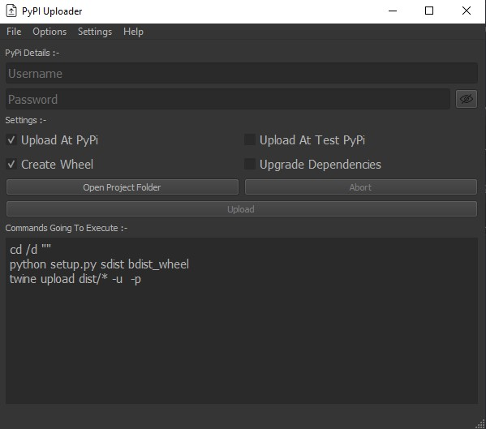
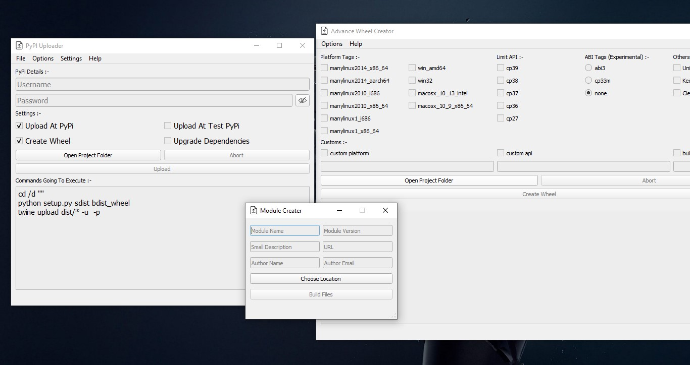

# Up To PyPi

<p align="center">
  <a href="https://pypi.org/project/up-to-pypi/"></a>
  <a href="https://www.python.org/downloads/" title="Python Version"></a>
  <a href="LICENSE" title="License: MIT"></a>
  <a href="https://pypi.org/project/up-to-pypi/"></a>
  <a href="https://github.com/360modder/up-to-pypi"></a>
</p>

A gui utility for uploading packages to pypi. Now supports **linux** too.

## Installations

```bash
pip install up-to-pypi
```

Or install from github repository.

```bash
pip install https://github.com/360modder/up-to-pypi/archive/master.zip
```

## Usage

```bash
$ up-to-pypi
```

## GUI Preview

<p align="center">
  
  
</p>

## License

© 2021 360modder

This repository is licensed under the MIT license. See LICENSE for details.
